# Learning programming, the Elon Musk way
why we create a set of robotics to learn programming?

Inspired by this idea: "It is important to teach problem solving or teach to the problem not to the tools so this would be like you are trying to teach people about how engines work. Before, you know you could start by the more traditional approach, would be to say we're going to teach you all about screwdrivers and wrenches and you even have a course on screwdrivers, a course on wrenches, and all these things and its a very difficult way to do it. A much better way would be like here's the engine. Now let's take it apart. How are we going to take it apart? Oh, you need a screwdriver, that's what the screwdrivers for. You need a wrench, that's what the wrench is for. Then a very important thing happens, whcih is that the relevance of the tools becomes apparent." --- Elon Musk

We create these robots. You first see these robots working, then take them apart, in terms of their mechatronic working principles, electronics, programming design principles and algorithm. In the meantime, the relevance of the software and hardware parts becomes apparent.

Here are some examples, and all the robotics use the same controller hardware board we will discuss later:

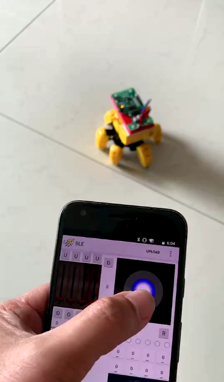

A 6-leg spider controlled by android phone App.

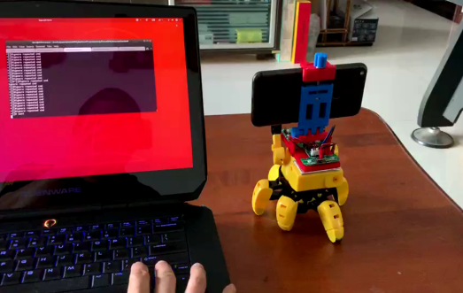

The phone running android app is attached to the spider, acting as a bridge between the spider and the user controlling it over the internet, in the IoT way.

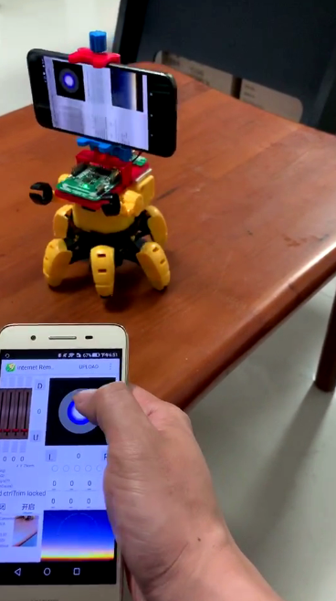
If all we need is to control the spider movement over the internet, we don't even need the programming computer. Another phone running the same app in a different mode will do the trick.

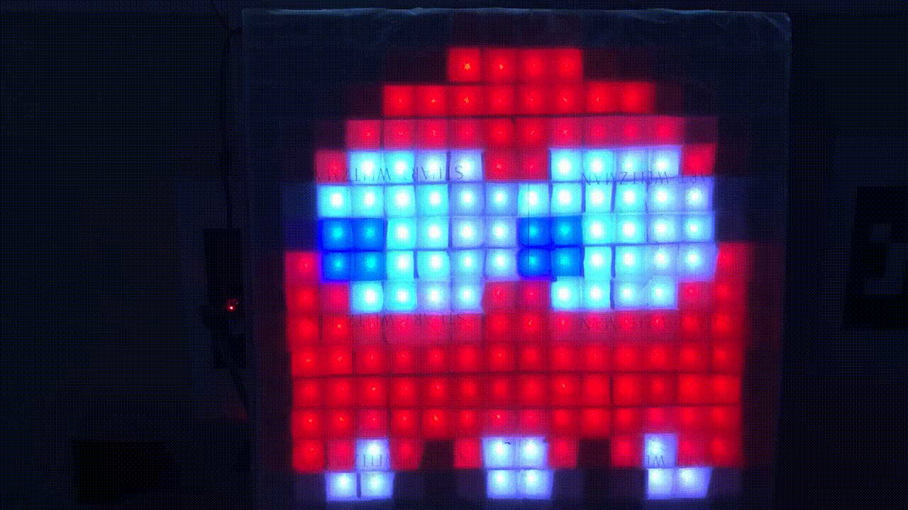
Continue with the IoT concept, the hardware controller is now hooked up with a 16-by-16 LED matrix display board. We can write code anywhere in the world to push display pattern to the LED board.

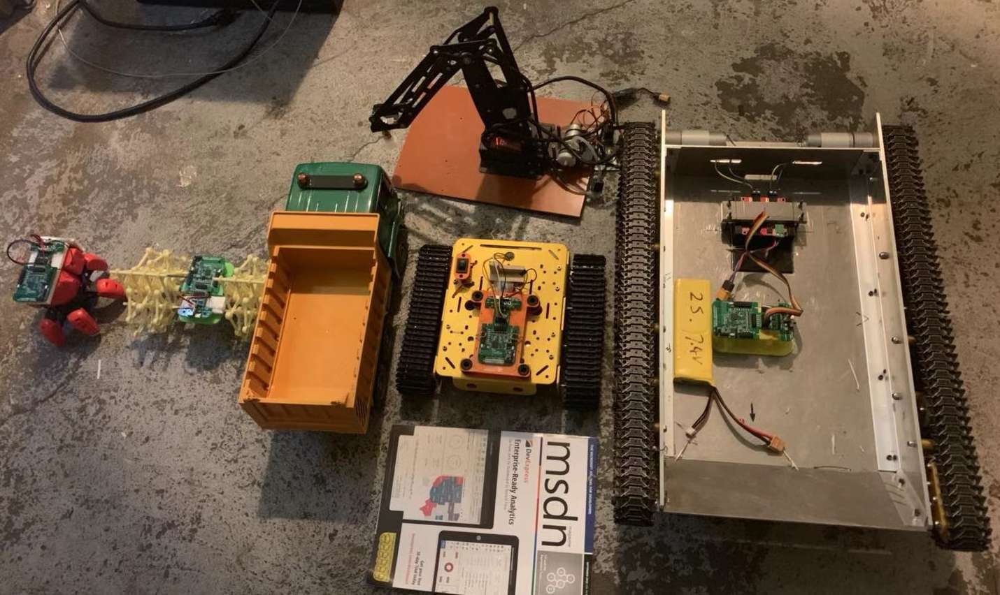
Here are a lot more land vehicle platforms we can prorgram.

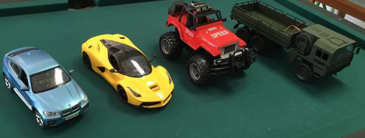
Here are some nice looking land vehicle platforms.

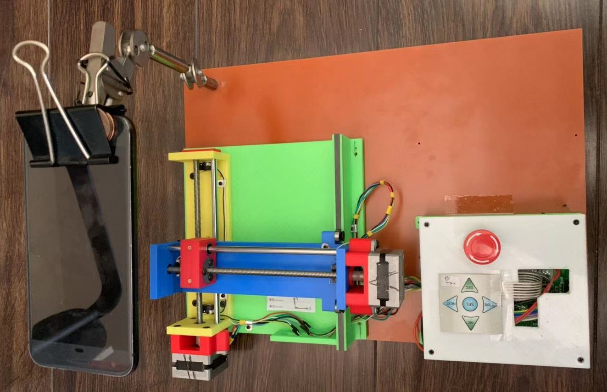
The hardware controller can operate this 2D platform, like your 3D printer. With a lens attached to your mobile phone, we can write code to take images programmably and study the microscopic world.

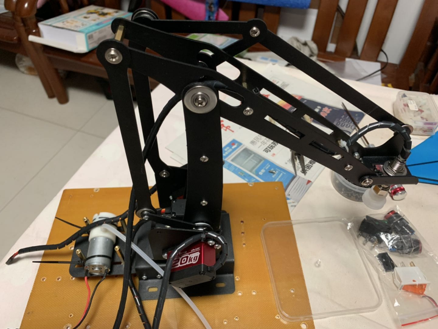
Robotic arm is always a must in the robotic programming topics.

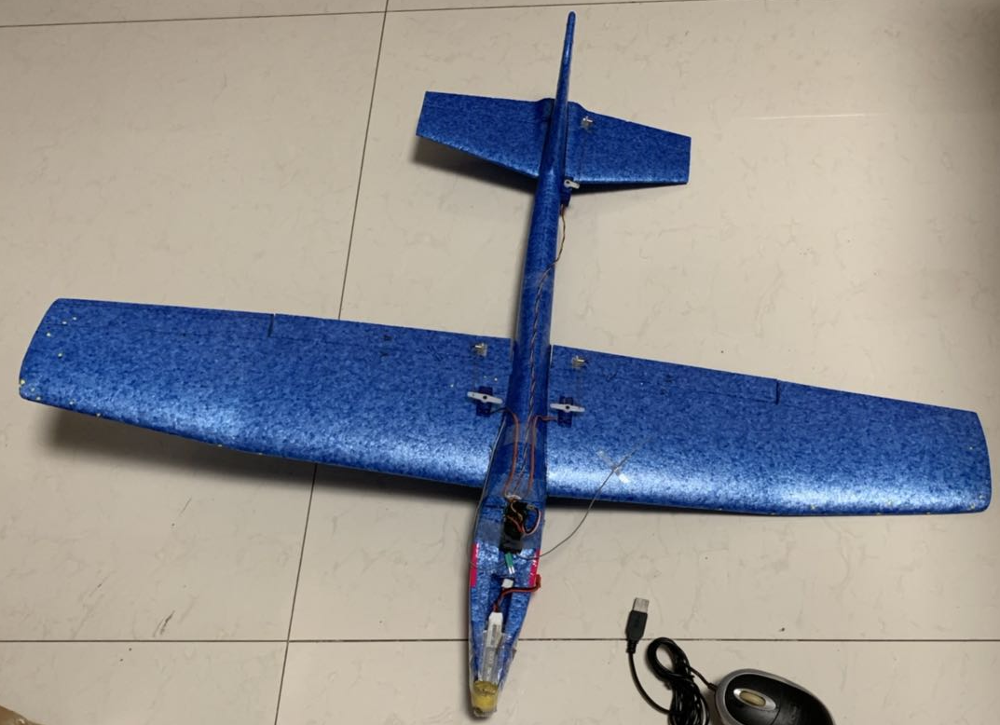
The hardware controller has a full fledged flight control feature built-in. We can also try our own PID control performance.

Please don't limit the possibilities by the above-mentioned items, my friends and I are creating new robotic models all the time. For example, we are working on an automated hydroponic system and AI based plant disease diagnosis.

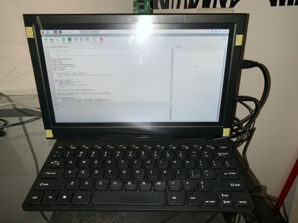
After hearing complaints on software package maintenance, wield PC problem, I first released a virtual machine image. It was still too difficult to share, to use. With this ~$30 credit card size RaspberryPi computer, a complete computer is assembled for programming. I release the RaspberryPi image so that those setup obstacles I solved won't bother my friends again. Should something wield happen, your computer science friend or me can remotely help with remote desktop. Ethernet is used to get internet access and the RaspberryPi built-in WiFi is re-purposed to be a router. Therefore, it's easier to solve a lot of networking issue, since we own 100% our router.

#SDK examples
Here is a less frequently updated intro. For detailed and more update to date tutorial contents, please visit http://breakthru.xyz/
Current SDK is written in Python3 and Java. I am wondering the next one should be Julia or C++.

Quite a few of my friends asked me whether it is better to focus on one language. Since this is all about learning programming, solving the same problem using different approaches, seems to be wasting of time.But in fact it strengthens our understanding. For example, try example code in Python vs. Java, we will easily understand what is interpretive language and what is compiled language.

Initially examples are introduced when I want to try or test new functions. I will be more systematic and try to cover most important programming aspects. For Java, I find college board AP-Computer Science exam has a pretty good list of syllabus, which I may follow. For Python, I didn't find widely accepted syllabus. Instead I will focus more on AI and robotic designs, hoping the wide spectrum of application scenario leads to a good coverage of programming skills.

## Python examples
Example code in this repo is built upon pip package m2controller version: 0.1.10

List of example programs, and the key point to learn:
- functionTest.py: basic function test
- spider_tutorial1.py: play the spider in a predefined pattern
- spider_tutorial2_intranetCtrl.py: The phone running android app is attached to the spider, acting as a bridge between the spider and the user controlling it from a computer in the same intranet, in the IoT way.
- spider_tutorial3_internetCtrl.py: similar to spider_tutorial2_intranetCtrl, but now the control is over the internet.
- ledmatrix_tutorial1_internetCtrl.py: send 16-by-16 LED matrix image pattern control over internet
- microscope_tutorial1.py: send command to android app, controlling the camera photo capture and platform movement to produce mosaic images. The platform starting point, the origin is manually adjusted. 
- microscope_tutorial2_autoHome.py: The enhancement over microscope_tutorial1 is this program takes telemetry data from the 2D platform, sensing whether its end-limiting button has been pressed. The system will automatically return to the home position before taking mosaic images.
- microscope_tutorial3_autoHome.py: The enhancement over microscope_tutorial2 is this program won't wait a hard coded time period for each stepper motor command, instead it will examine the motor feedback status, send the next motor movement command immediately after the motor become idle. The task will be completed faster than previous example.
- plane_tutorial1.py: Score if a deterministic figure-8 pattern is performed
- thunderstorm_tutorial1.py: play sound, ignite light, mimic a thunderstorm
- plant_care_tutorial1.py: plant growing automation

## Java examples
List of example programs, and the key point to learn:
- functionTest.java: basic function test
- servoTest.java: basic servo movement test
- roboticArm1_setGesture.java: move robotic arm to a designate gesture
- roboticArm2_setGestureMultiSteps.java: move robotic arm in a more smoothed way, a great angular movement is broken into multiple smaller steps
- roboticArm3_multiGestures.java: multiple moving steps
- roboticArm4_binaryOp.java: certain acutators, such as the pump or valve, is operated in on/off mode. Multiple smaller steps should not be used for them.
- l10_variableTypes.java: AP-CS concept of variable types, explained in Strandbeast robot.
- l1_variable.java: AP-CS concept of variable usage, explained in Strandbeast robot.
- l2_variableManipulation.java: AP-CS concept of variable manipulation, explained in Strandbeast robot.
- l3_arithmetic.java: AP-CS concept of arithmetic computation, explained in Strandbeast robot.

# brief introduction on hardware
For now, I have two form factors of hardware controller. New form factors are continously added to accomodate new applications.
## General-purpose experimental board
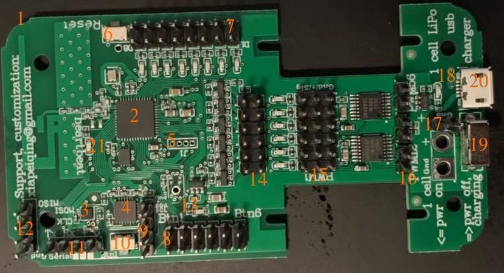
The hardware control board can be subdivided into:

1. RF antenna: please try to avoid having metal objects around, which will affect the antenna efficiency.
2. Main processor:integrated RF transceiver + ARM processor
3. Magnetic sensor: please try to avoid having magnetic material nearby.
4. Accelerometer/gyroscope and thermometer sensor IC
5. Firmware download interface
6. Reset button
7. Digital output port 1, there are 8 in total.
8. Digital input port 1, there are 6 in total.
9. I2C interface, from top to bottom on the image are:
10. Switch button connected to digital input port 1.
11. Serial port, the above picture is from left to right:
12. SPI bus, the picture above is from top to bottom:
13. Power Indicator.
14. OC-gate DC-load duty cycle control with a load capacity of 500mA.
15. The control signal output of the servo is driven. There are 6 sets of the same servo control signals. The pins of each servo are from left to right in the above figure:
16. Combines the two servo outputs into one, driving the DC load in both forward and reverse directions. The 6-way servo output can synthesize up to 3 forward and reverse drive control functions.
17. 2.54 mm pitch power input port, because of the presence of the charging circuit chip, the power supply can only use one LiPo lithium polymer battery.
18. 11S lithium battery charging indicator, extinguished when fully charged.
19. powerswitch
20. USB port only functions as a 5V power charger, not a USB device.
21. Program heartbeat LED indicator for displaying program running status.

## Stepper motor control function
When using the stepper motor function, the digital input port is defined as follows:
- Digital input port 0: EmergencyStop
- Digital input port 1: ForceMove
- Digital input port 2: x limit -
- Digital input port 3: x limit +
- Digital input port 4 :y limit-
- Digital input port 5: y limit +
- Digital output port is defined as follows:
- Digital output port 0: drive stepping motor 1 step signal. Each pulse stepper motor runs one step.
- Digital output port 1: A direction signal for driving the stepping motor 1.
- Digital output port 2: A walking signal for driving the stepping motor 2.
- Digital output port 3: A direction signal for driving the stepping motor 2.
- Digital output port 4: Enable signal for all drive motors. By resetting the enable signal, the operating current of the stepping motor can be completely cut off when the stepping motor is not working, and the power consumption and heat generation of the entire system can be reduced.

## Wearable experimental board
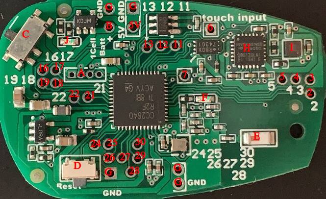
All of the pinouts identified by numbers in the above figure are digitally equivalent to the pin definition of the chip produced by Texas Instruments.

Since two PCB versions share the same functionality. The figure below maps the IO pins in the wearable version to the general purpose experiment board version.
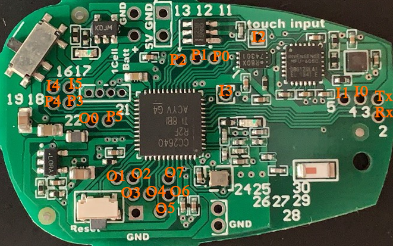

# android app
I maintain an android app as the easiest way among a few methods to program the hardware, other approaches includes using a RaspberryPi computer or any computer with built-in bluetooth or dongle to write user program on top of the SDK I write:

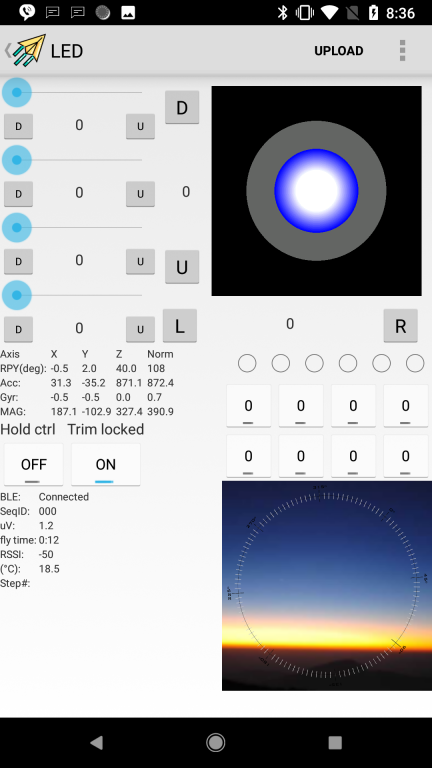

New features are continuously added. One goal is to better utilize the phone camera, sensors, connectivities and computation power.

It is available in Google playstore, please search M2ROBOTS.

In case it is difficult to access Google playstore, alternative download link:
https://pan.baidu.com/s/1bZHW71HdRQx5NTLz0haREQ

# User manual
User manual:
https://docs.google.com/document/d/1PgZ4B7knrJwd1pmbuxnDjpHrCE-opn28DH4dm7CgX7g/edit?usp=sharing

中文版：
https://docs.google.com/document/d/1YwpXk-FR-y4ukiNmsuH3dIxmI8mh2pJtTJBfqWPEc-0/edit?usp=sharing

